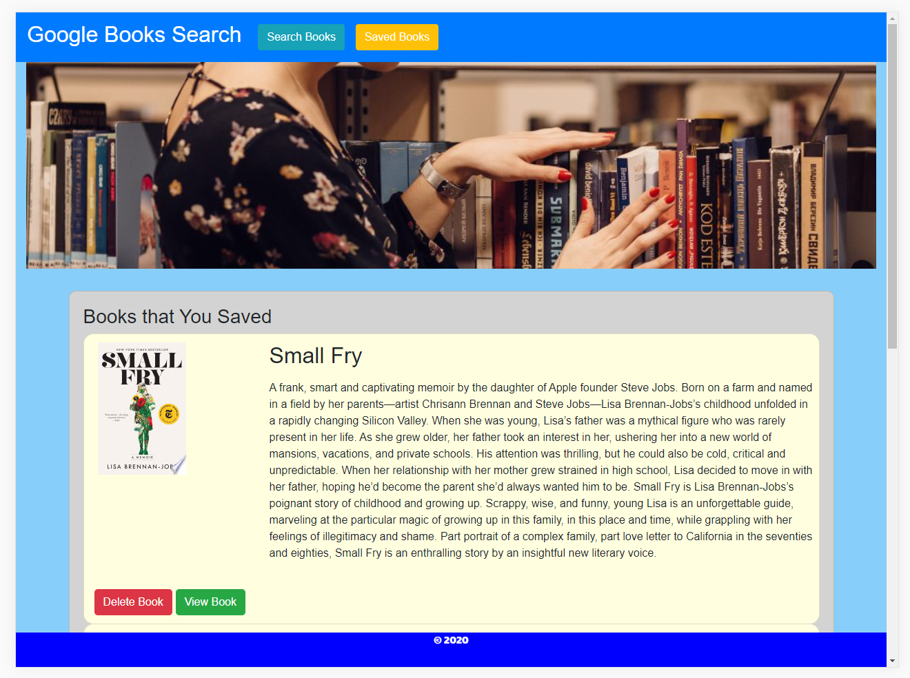

# mern-books-search
A new React-based Google Books Search app that also uses Node, Express and MongoDB so that users can save books to review or purchase later.

## Demo: 



## Application Concept:

In this activity, I created a React-based Google Books Search application. My application uses React components, helper/util functions, and React lifecycle methods to query and display books based on user searches. I also used Node, Express, and MongoDB so that users can save books to review or purchase later. Each book will include a link that directs you to the Google Book listing.

## Technologies Used

 * Bootstrap - Front-end toolkit
 * React - JavaScript library for building user interfaces
 * Node/Express - Server side code
 * MongoDB - Database for storing book data

The front-end React app will auto-reload as it's updated via webpack dev server, and the backend Express app will auto-reload independently with nodemon.

## Starting the app locally

Start by installing front and backend dependencies. While in this directory, run the following command:

```
npm install
```

This should install node modules within the server and the client folder.

After both installations complete, run the following command in your terminal:

```
npm start
```

The app should now be running on <http://localhost:3000>. The Express server should intercept any AJAX requests from the client.

## Deployment (Heroku)

To deploy, simply add and commit your changes, and push to Heroku. As is, the NPM scripts should take care of the rest.

https://nunetang-books.herokuapp.com/
